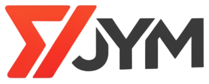

# Sistema JyM - Sistema de Gerenciamento de Academias

<p align="center">
  
</p>

<p align="center">
  <strong>Sistema Multi-Tenant de Gestao de Academias com Reconhecimento Facial</strong>
</p>

<p align="center">
  
  
  
  
  
</p>

---

## Sobre o Projeto

O **Sistema JyM** e um projeto academico desenvolvido como Trabalho de Conclusao de Curso (TCC) para a disciplina de **Estagio Supervisionado** do curso de **Sistemas de Informacao** da **Universidade Paranaense (UNIPAR) - Campus Umuarama**.

### Autores
- **Joao Guilherme Chagas Piaia**
- **Matheus Maiante Marques de Almeida**

### Orientadores
- **Prof. Elyssandro Piffer** (Orientador)
- **Prof. Carlos Eduardo Simoes Pelegrin** (Co-orientador)
- **Prof. Leandro Clementino de Lima** (Co-orientador)
- **Prof. Jose Roberto Pelissari Junior** (Co-orientador)

### Objetivo

O JyM foi desenvolvido para otimizar a gestao de academias, oferecendo uma solucao completa e moderna para:

- **Gestao Multi-Academia:** Gerenciamento centralizado de multiplas unidades
- **Controle de Acesso:** Reconhecimento facial e codigo de acesso como fallback
- **Gestao de Clientes:** Cadastro completo com captura facial
- **Controle Financeiro:** Mensalidades, vendas, contas a pagar/receber
- **Estoque e Compras:** Produtos, materiais e gestao de fornecedores
- **Relatorios:** Analises detalhadas em PDF

---

## Requisitos do Sistema

### Requisitos de Software

| Software | Versao Minima | Recomendado |
|----------|---------------|-------------|
| PHP | 8.2 | 8.3+ |
| Composer | 2.0 | 2.7+ |
| Node.js | 18.x | 20.x LTS |
| NPM | 9.x | 10.x |
| MySQL | 8.0 | 8.0+ |
| Git | 2.x | 2.40+ |

### Requisitos de Hardware (Minimo)

- **Processador:** Dual-core 2.0 GHz
- **Memoria RAM:** 4 GB
- **Armazenamento:** 2 GB livres
- **Webcam:** Necessaria para reconhecimento facial

### Extensoes PHP Necessarias

```
php-bcmath
php-ctype
php-fileinfo
php-json
php-mbstring
php-openssl
php-pdo
php-pdo_mysql
php-tokenizer
php-xml
php-gd (para geracao de PDF)
```

### Ambiente de Desenvolvimento Recomendado

- **Windows:** [Laragon](https://laragon.org/) (recomendado), XAMPP ou WAMP
- **Linux:** Apache/Nginx + PHP-FPM
- **macOS:** Laravel Valet ou Herd

---

## Manual de Instalacao

### Passo 1: Clonar o Repositorio

```bash
git clone https://github.com/MatheusMatiasUniver/Sistema-JyM.git
cd Sistema-JyM
```

### Passo 2: Instalar Dependencias do PHP

```bash
composer install
```

### Passo 3: Instalar Dependencias do Node.js

```bash
npm install
```

### Passo 4: Configurar Variaveis de Ambiente

```bash
# Copiar arquivo de exemplo
cp .env.example .env

# Gerar chave da aplicacao
php artisan key:generate
```

### Passo 5: Configurar o Banco de Dados

Edite o arquivo `.env` com as credenciais do seu banco de dados:

```env
DB_CONNECTION=mysql
DB_HOST=127.0.0.1
DB_PORT=3306
DB_DATABASE=sistema_jym
DB_USERNAME=root
DB_PASSWORD=sua_senha
```

### Passo 6: Criar o Banco de Dados

```sql
CREATE DATABASE sistema_jym CHARACTER SET utf8mb4 COLLATE utf8mb4_unicode_ci;
```

### Passo 7: Executar Migracoes e Seeds

```bash
# Executar migracoes
php artisan migrate

# Popular banco com dados de exemplo (opcional, recomendado para testes)
php artisan db:seed --class=SimulationSeeder
```

### Passo 8: Configurar WebSocket (Laravel Reverb)

Edite o arquivo `.env`:

```env
BROADCAST_CONNECTION=reverb

REVERB_APP_ID=sistema-jym
REVERB_APP_KEY=sua_chave_reverb
REVERB_APP_SECRET=seu_secret_reverb
REVERB_HOST=localhost
REVERB_PORT=8080
REVERB_SCHEME=http

VITE_REVERB_APP_KEY="${REVERB_APP_KEY}"
VITE_REVERB_HOST="${REVERB_HOST}"
VITE_REVERB_PORT="${REVERB_PORT}"
VITE_REVERB_SCHEME="${REVERB_SCHEME}"
```

### Passo 9: Compilar Assets

```bash
# Para desenvolvimento
npm run dev

# Para producao
npm run build
```

### Passo 10: Iniciar os Servidores

**Metodo 1: Comando unico (Recomendado)**
```bash
composer dev
```

**Metodo 2: Iniciar individualmente**
```bash
# Terminal 1 - Servidor PHP
php artisan serve

# Terminal 2 - WebSocket (Laravel Reverb)
php artisan reverb:start

# Terminal 3 - Vite (apenas desenvolvimento)
npm run dev

# Terminal 4 - Queue Worker (opcional)
php artisan queue:work
```

**Metodo 3: Windows - Arquivo BAT**
```bash
iniciar-servidores.bat
```

### Passo 11: Acessar o Sistema

Abra o navegador e acesse:
```
http://localhost:8000
```

---

## Credenciais de Acesso (Dados de Teste)

Apos executar o `SimulationSeeder`, as seguintes credenciais estarao disponiveis:

### Administrador (Acesso Total)

| Campo | Valor |
|-------|-------|
| Usuario | `admin` |
| Senha | `admin123` |

### Funcionarios por Academia

**Iron Fitness Academia:**
| Nome | Usuario | Senha |
|------|---------|-------|
| Maria Souza | `maria.souza` | `func123` |

**Power House Gym:**
| Nome | Usuario | Senha |
|------|---------|-------|
| Pedro Henrique Lima | `pedro.lima` | `func123` |

---

## Manual do Usuario

### 1. Login no Sistema

1. Acesse `http://localhost:8000`
2. Insira seu **usuario** e **senha**
3. Clique em **Entrar**

O sistema direcionara voce ao Dashboard principal com as metricas da academia.

### 2. Navegacao Principal

O menu lateral oferece acesso a todas as funcionalidades:

| Menu | Descricao |
|------|-----------|
| **Dashboard** | Visao geral com metricas e graficos |
| **Clientes** | Cadastro e gestao de clientes |
| **Mensalidades** | Controle de pagamentos |
| **Planos** | Configuracao de planos de assinatura |
| **Vendas** | Registro de vendas de produtos |
| **Produtos** | Catalogo e estoque |
| **Categorias** | Categorias de produtos |
| **Marcas** | Marcas de produtos |
| **Fornecedores** | Cadastro de fornecedores |
| **Compras** | Pedidos de compra |
| **Equipamentos** | Gestao de equipamentos |
| **Materiais** | Materiais de consumo |
| **Financeiro** | Contas a pagar/receber |
| **Relatorios** | Relatorios gerenciais |
| **Reconhecimento** | Modo Kiosk |
| **Usuarios** | Gestao de usuarios (Admin) |
| **Academias** | Gestao de academias (Admin) |

### 3. Cadastro de Clientes

1. Acesse **Clientes** > **Adicionar Novo Cliente**
2. Preencha os dados pessoais:
   - Nome completo
   - CPF (11 digitos, sem formatacao)
   - Data de nascimento
   - Telefone
   - E-mail
3. Selecione o **Plano de Assinatura**
4. Capture a **foto facial** (necessario para reconhecimento)
5. Clique em **Salvar**

O sistema gerara automaticamente um **Codigo de Acesso** de 6 digitos.

### 4. Controle de Acesso (Modo Kiosk)

O Kiosk e a interface de entrada dos clientes na academia:

1. Acesse **Reconhecimento** no menu
2. A camera sera ativada automaticamente
3. O cliente posiciona o rosto na camera
4. O sistema identifica e valida:
   - **Acesso Liberado:** Cliente ativo
   - **Acesso com Aviso:** Cliente inadimplente (permite entrada)
   - **Acesso Negado:** Cliente inativo

**Fallback por Codigo de Acesso:**
- Se o reconhecimento facial falhar, o cliente pode digitar seu codigo de 6 digitos

### 5. Gestao de Mensalidades

1. Acesse **Mensalidades**
2. Visualize mensalidades pendentes/vencidas
3. Para registrar pagamento:
   - Clique em **Pagar**
   - Selecione a **forma de pagamento**
   - Confirme

O status do cliente sera atualizado automaticamente.

### 6. Registro de Vendas

1. Acesse **Vendas** > **Registrar Nova Venda**
2. Selecione o cliente (opcional)
3. Adicione produtos:
   - Busque pelo nome
   - Informe a quantidade
   - Clique em **Adicionar**
4. Selecione a **forma de pagamento**
5. Clique em **Finalizar Venda**

O estoque e atualizado automaticamente.

### 7. Compras e Estoque

**Criar Pedido de Compra:**
1. Acesse **Compras** > **Nova Compra**
2. Selecione o **Fornecedor**
3. Adicione produtos com quantidade e preco
4. Informe frete/descontos (opcional)
5. Clique em **Salvar**

**Receber Compra:**
1. Na lista de compras, localize o pedido
2. Clique em **Receber**
3. O estoque sera atualizado automaticamente
4. Uma conta a pagar sera gerada

### 8. Relatorios

Acesse **Relatorios** e escolha:

| Relatorio | Descricao |
|-----------|-----------|
| **Faturamento** | Receitas, custos e lucro operacional |
| **Vendas** | Analise de vendas por produto |
| **Frequencia** | Acessos de clientes por periodo |
| **Inadimplencia** | Clientes com mensalidades atrasadas |
| **Gastos** | Contas pagas por categoria |
| **Compras** | Historico de compras |
| **Ruptura** | Produtos abaixo do estoque minimo |
| **Margem** | Lucro por produto |
| **Por Funcionario** | Desempenho de vendas |

Todos os relatorios podem ser exportados em **PDF**.

### 9. Multi-Academia (Administradores)

Administradores podem gerenciar multiplas academias:

1. Acesse **Academias** no menu
2. Visualize todas as unidades cadastradas
3. Use o **seletor de academia** no topo para alternar o contexto
4. Todos os dados exibidos serao filtrados pela academia selecionada

---

## Comandos Uteis

```bash
# Iniciar todos os servidores
composer dev

# Executar testes
composer test

# Limpar caches
php artisan cache:clear
php artisan config:clear
php artisan view:clear
php artisan route:clear

# Recriar banco de dados com dados de teste
php artisan migrate:fresh --seed

# Verificar status de mensalidades (executar diariamente)
php artisan app:verificar-mensalidades

# Compilar assets para producao
npm run build
```

---

## Estrutura do Projeto

```
Sistema-JyM/
├── app/
│   ├── Console/Commands/     # Comandos Artisan personalizados
│   ├── Events/               # Eventos de Broadcasting
│   ├── Http/
│   │   ├── Controllers/      # Controllers da aplicacao
│   │   ├── Middleware/       # Middlewares (AcademiaContext, Admin, etc.)
│   │   └── Requests/         # Form Requests para validacao
│   ├── Jobs/                 # Jobs assincronos
│   ├── Models/               # Models Eloquent
│   └── Services/             # Services de logica de negocio
├── database/
│   ├── migrations/           # Migracoes do banco de dados
│   └── seeders/              # Seeders para dados de teste
├── docs/                     # Documentacao do projeto
├── public/
│   ├── img/                  # Imagens estaticas
│   └── models/               # Modelos do face-api.js
├── resources/
│   ├── css/                  # Estilos CSS
│   ├── js/                   # JavaScript
│   └── views/                # Views Blade
├── routes/
│   ├── web.php               # Rotas da aplicacao
│   └── channels.php          # Canais de Broadcasting
└── tests/                    # Testes automatizados
```

---

## Niveis de Acesso

| Nivel | Permissoes |
|-------|------------|
| **Administrador** | Acesso total ao sistema, incluindo gestao de multiplas academias, usuarios e configuracoes |
| **Funcionario** | Acesso operacional a academia designada (clientes, vendas, mensalidades) |

---

## Tecnologias Utilizadas

### Backend
- **Laravel 12** - Framework PHP
- **PHP 8.2+** - Linguagem de programacao
- **MySQL 8** - Banco de dados relacional
- **Laravel Reverb** - WebSocket server
- **DomPDF** - Geracao de relatorios PDF

### Frontend
- **Blade** - Template engine
- **Tailwind CSS 3.4** - Framework CSS
- **Vite 7** - Build tool
- **Alpine.js** - Framework JavaScript reativo
- **face-api.js** - Reconhecimento facial
- **Pusher.js** - Comunicacao em tempo real

---

## Problemas Conhecidos

1. **Reconhecimento facial em ambientes escuros:** O sistema pode ter dificuldades em condicoes de baixa luminosidade
2. **Alertas automaticos de estoque:** Disponivel apenas via Relatorio de Ruptura (nao ha notificacoes push)
3. **Integracao com gateways de pagamento:** Nao implementado (preparado para futura integracao)

---

## Licenca

Este projeto e distribuido sob a licenca MIT. Veja o arquivo [LICENSE](LICENSE) para mais detalhes.

---

## Suporte

Este e um projeto academico e nao possui suporte comercial. Para duvidas ou sugestoes, abra uma **Issue** no repositorio do GitHub.

---

<p align="center">
  <strong>Sistema JyM</strong> - Desenvolvido para o curso de Sistemas de Informacao da UNIPAR
</p>

<p align="center">
  Umuarama - PR, 2025
</p>

